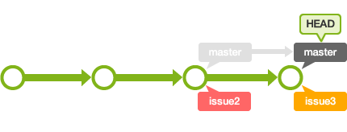

## Git 版本管理

Git 是一个用于控制管理代码历史版本的工具，区别与集中式的 SVN，Git 使用了分布式的管理方式。Git 可以在任何时候，把文档的状态作为更新记录保存起来。
通常在团队协作中，每个人都拥有自己的一个本地代码仓库，可以对自己本地的代码进行管理。同时，团队会用一个共享的远程仓库，可以将代码版本在各个成员之间共享。

### 1. 基本信息设置

#### 配置用户和邮箱

	$ git config --global user.name "<用户名>"
	$ git config --global user.email "<邮箱>"

#### 基础配置

1. 查看用户配置：	`$ git config --list`
2. 设置命令别名： `$ git config --global alias.co checkout` 
例：把「checkout」缩略为「co」，然后就使用「co」来执行命令。


### 2. 基础操作

#### 初始化本地仓库
  
	$ git init

初始化一个本地仓库之后，工作目录下就会新增一个 `.git` 目录。

#### 克隆远程仓库

	$ git clone <remote address> <name>

1. `<remote address>` 是远程仓库的地址
2. `<name>` 是克隆后本地仓库的目录名称。

例：`$ git clone git@github.com:Vince6666/demo1.git demo`

如果已经有了一个远程仓库库，则可以不需要初始化一个本地仓库，直接克隆远程的仓库到本地，并且该仓库是和远程仓库关联的。如果你有远程仓库的权限，就可以对这个仓库 `push` 你的提交。

#### 查看仓库状态

	$ git status

该命令可以查看当前的仓库（代码分支）的状态。

#### 提交文件修改的历史记录

当我们在本地仓库进行修改之后，就要将我们的修改作为代码的一个历史版本进行提交：

	$ git add <file_name>

执行该命令之后，文件就会被添加到 git 仓库的暂存区（stage）中。  

使用 `git add .` 可以直接将当前目录下的修改全部添加到暂存区中，一般情况下会很方便。  

添加到暂存区的文件，还需要再提交到本地仓库中：

	$ git commit -m '本次提交说明'

这样就将我们的修改提交到本地仓库中，生成一条历史记录。


##### 使用 vim 编辑提交说明

如果在提交时不带 `-m` 参数，而是输入 `git commit` 直接回车，则会进入到 vim 编辑器的界面，默认使用 vim 编辑器进行提交信息的编写。  

1. `#` 开头的是注释
2. 按 `i` 进入插入模式，可以编辑信息；按 `Esc` 退出插入模式，回到普通模式
3. 按 `:` 进入命令模式。常见命令： 

		:q 	退出
		:q! 	强制退出，不进行保存
		:wq	保存并退出
		:wq! 	强制保存并退出

#### 添加远程仓库地址

如果你的本地仓库是自己通过 `git init` 命令创建的（不是克隆下来的），并且你想要将它放到一个远程仓库上，与团队其他成员共享，就需要为本地仓库添加远程仓库连接，也就是说将本地仓库的历史版本库放到远程仓库中保存，与远程仓库关联。

	git remote add <name> <remote address>

1. `<name>` 是远程仓库的名称，默认是 `origin`
2. `<remote address>` 是远程仓库地址

例如： `$ git remote add origin https://github.com/Vince6666/demo.git`  
或者： `$ git remote add origin git@github.com:Vince6666/demo1.git`

使用 `$ git remote add` 命令为本地仓库添加一个远程仓库地址，地址可以是 `http/https` 格式的也可以是 `ssh` 格式的。

#### 将本地仓库的提交记录推送到远程仓库

为了将本地数据库的修改记录共享到远程数据库，必须上传本地数据库中存储的修改记录。
执行 `Push` 之后，本地的修改记录会被上传到远程数据库。所以远程数据库的修改记录就会和本地数据库的修改记录保持同步。

	$ git push -u origin master

执行该命令可以向远程仓库 `origin` 进行推送。如果指定了 `-u` 选项，那么下一次推送就可以省略分支名称了。_**但是在首次执行命令向空的远程仓库推送时，必须指定远程仓库和分支名称。**_

#### 拉取并合并其他修改

进行拉取(Pull) 操作，就是从远程数据库下载最近的变更日志，并覆盖自己本地数据库的相关内容。当团队其他成员对该分支上的代码进行了修改并且已经 push 到远程仓库后，你可以将他的提交拉取到本地并且将他的提交进行合并自己本地仓库上。

	$ git pull <name> <branch>

第一次拉取远程仓库的修改的时候，由于本地分支与远程分支还没有建立起关联关系，所以需要指定远程仓库和分支名称。 

例如： `$ git pull origin master`

之后进行拉取操作时，可直接执行 `git pull` 命令，这样，本地仓库就会获取到其他成员提交的代码修改。

#### 整合修改记录

在团队成员进行同时开发时，很可能你的某一次 `push` 操作会被拒绝，这是因为你们同处在一个代码版本下，在你进行 `push` 之前，已经有其他成员进行 `push` 了，这时你再进行 `push`，就会出现下面的错误提示：

```
$ git push
To github.com:Vince6666/demo1.git
 ! [rejected]        master -> master (fetch first)
error: failed to push some refs to 'git@github.com:Vince6666/demo1.git'
hint: Updates were rejected because the remote contains work that you do
hint: not have locally. This is usually caused by another repository pushing
hint: to the same ref. You may want to first integrate the remote changes
hint: (e.g., 'git pull ...') before pushing again.
hint: See the 'Note about fast-forwards' in 'git push --help' for details.
```

这种情况下，你需要先执行 `git pull` 命令，将远程的提交拉取下来并合并到本地分支。然后再进行 `push` 操作。

**但是**，有时候我们执行 `git pull` 操作之后，可能会出现无法自动合并的情况。_**这是因为远程仓库和本地仓库的同一个地方都发生了修改，无法自动判断要选用哪一个修改，所以就会发生冲突。**_

这是 git 会在发生冲突的地方修改文件的内容，如下所示，需要我们手动修正冲突：
```
// 一些其他内容...
// 一些其他内容...

<<<<<<<< HEAD
// 本地修改的内容...
=======================
// 远程仓库的内容...
>>>>>>>> 3a23b640265efb45cfee715865221bd2ae3c9c29

// 一些其他内容...
// 一些其他内容...
```
发生冲突的部分会用 `<<<<< HEAD` 和 `>>>>> commit的Hash值` 包围起来，其中，`========` 是本地修改的内容与远程仓库的内容分隔线。
这部分的冲突需要自己手动修正，修正后将 `<<<`等标志删掉之后，就可以进行 `push` 推送了。

#### 查看提交历史记录

	$ git log

执行该命令可以查看历史提交记录，每个提交记录都会有一个 `hash`，另外还有作者、日期和提交说明：
```
commit fe62a495d26d3751409a8fd0a7969752b71171ec
Author: Vince6666 <13257688007@163.com>
Date:   Sat Feb 15 21:26:58 2020 +0800

    first commit
```

### 3. 使用分支

分支功能是 git 最为强大的功能之一，它能够让你并发地在多个场景下进行开发，并且可以让你同时开发不同功能而不冲突，用于区分功能或版本。

分叉的分支可以合并，为了不受其他开发人员的影响，您可以在主分支上建立自己专用的分支。完成工作后，将自己分支上的修改合并到主分支。因为每一次提交的历史记录都会被保存，所以当发生问题时，定位和修改造成问题的提交就容易多了。

在仓库进行最初的提交后, git 会创建一个名为 `master` 的分支。因此之后的提交，在切换分支之前都会添加到 `master` 分支里。

#### 创建分支

	$ git branch <branch_name>

执行该命令会创建一条新的分支。若不指定分支名称，直接执行 `git branch` 命令，则不会创建任何分支，而是显示当前所有分支。

#### 切换分支

在日常开发的时候，我们可能经常会需要切换到不同的开发场景，可以执行以下命令来切换分支：

	$ git checkout <branch_name>|<tag>|<commit hash id>

`checkout` 不仅可以切换分支，还可以切换 `tag` 或者 `commit hash id` 等环境的代码。

**在 git 中是使用 `HEAD` 指针来指向当前的提交记录的，而 `checkout` 命令实际上就是将 git 的 `HEAD` 指针指向了指定的提交记录。**

**PS:** `checkout` 命令后面还可以添加 `-b` 选项，表示创建一个新分支并切换到该分支，如： `git checkout -b <branch_name>` 

**举例：**
创建一条名称为 test 的分支，并切换到该分支：

	$ git branch test

如下图所示，在当前的提交记录 `commit C` 上多出了一个 `test` 分支:


此时 `HEAD` 指针还是指向 `master` 分支，然后我们执行 `checkout` 命令切换分支：

	$ git checkout test


这时 `HEAD` 指针就指向了 `test` 分支，现在进行的修改就都是在 `test` 分支上，不会影响到 `master` 分支上的内容。

#### HEAD指针

上面说过，`HEAD` 指向当前的提交记录，也就是现在使用中的分支的最后一次更新，通常默认是指向 master 分支的最后一次提交。**通过移动 HEAD 指针，就可以变正在使用的分支。**

在提交时使用 `~` 或 `^` 可以指定某个提交的相对位置：
1. `~` 可以指定 `HEAD` 之前若干次的提交记录。
2. `^` 可以指定前一个提交记录。


#### stash

有时候 checkout 可能不会顺利的切换过去，原因是你的工作区或暂存区中对一些文件的修改的还没有提交。

这种情况下，如果 checkout 的目标分支中相同的文件也有修改，则 checkout 会失败，并提醒你先对文件的修改进行提交。
另一种情况是，即使 checkout 的目标分支中没有相同文件的修改，但你在目前的分支的修改也不会保存，而是会被移动到 checkout 的目标分支中，这显然不是我们想要的结果。

出现以上情况时，我们可以先将当前工作区或暂存区中的修改进行 "储藏"：

	$ git stash

`stash` 是临时保存文件修改内容的区域。它可以在不提交的情况下保存当前的代码，将当前的修改压入到一个栈中。然后当你解决了问题，想回到原来的工作代码环境，你只需要切换到原来的分支上，进行：

	$ git stash pop

这里就会默认拿出栈顶的代码，也就是最近一次 `stash`，并将其反映到你的工作区或暂存区中。

#### 删除分支

在 `branch` 命令后面指定 `-d` 选项，可以删除分支：
```
$ git branch -d issue1
Deleted branch issue1 (was b2b23c4).
```

#### 合并分支

执行 `merge` 命令可以合并分支。该命令将指定分支导入到 `HEAD` 指定的分支。

在多个分支并行开发之后，可能需要将这些分支合并到 master 分支，这是就可能出现合并冲突的情况，原因是在不同分支在相同的文件都进行了修改。

**举例：**
我们在 `issue2` 分支和 `issue3` 分支都对 `index.txt` 文件进行了修改，然后要把这两个分支修改的内容都合并到 `master` 分支中。

首先切换到 `master` 分支，然后先将 `issue2` 分支导入到 `master` 分支，这个能够正常进行。
```
$ git checkout master
$ git merge issue2
```
接着，我们需要将 `issue3` 的修改也导入到 `master` 分支中：
```
$ git merge issue3
Auto-merging index.txt
CONFLICT (content): Merge conflict in index.txt
Automatic merge failed; fix conflicts and then commit the result.
```
会提示自动合并失败，所以需要修正冲突部分的内容，然后重新进行提交。


#### 使用 rebase 合并

除了上面我们使用 `merge` 进行合并，还可以使用 `rebase`，能够让提交的历史记录显得更加简洁。

先取消刚才的对 `issue3` 的合并，回到只对 `issue2` 合并时的状态： 
```
$ git reset --hard HEAD~
```
然后切换到 `issue3` 分支后，对 `master` 执行 `rebase` 命令：
```
$ git checkout issue3
Switched to branch 'issue3'

$ git rebase master
First, rewinding head to replay your work on top of it...
Applying: pull 说明
Using index info to reconstruct a base tree...
M       index.txt
Falling back to patching base and 3-way merge...
Auto-merging index.txt
CONFLICT (content): Merge conflict in index.txt
error: Failed to merge in the changes.
Patch failed at 0001 pull 说明
Use 'git am --show-current-patch' to see the failed patch

Resolve all conflicts manually, mark them as resolved with
"git add/rm <conflicted_files>", then run "git rebase --continue".
You can instead skip this commit: run "git rebase --skip".
To abort and get back to the state before "git rebase", run "git rebase --abort".
```

执行 `rebase` 命令会给出上面的提示，和 `merge` 时的操作相同，这时我们先修改 `index.txt` 中发生冲突的部分，修正冲突之后，执行 `add` 命令。
这时的提交不是执行 `commit` 命令，而是如提示中所说的，执行 `rebase` 命令的 `--continue` 选项进行提交。

我们可以在 `add` 之后执行 `git status` 查看当前的状态，显示：`rebase` 正在进行中，在所有冲突修正之后执行 `--continue` 选项：

```
$ git add index.txt

$ git status
rebase in progress; onto eaba0f4
You are currently rebasing branch 'issue3' on 'eaba0f4'.
  (all conflicts fixed: run "git rebase --continue")

Changes to be committed:
  (use "git reset HEAD <file>..." to unstage)

        modified:   index.txt

$ git rebase --continue
Applying: pull 说明
``` 

执行完 `rebase` 之后，我们切换回 `master` 分支，再去直接合并 `issue3` 分支，这时我们使用 `merge` 命令就可以直接合并，历史记录和之前直接使用 `merge` 并不一样，而是变得更加简洁了。
```
$ git checkout master
Switched to branch 'master'

$ git merge issue3
Updating eaba0f4..156d99a
Fast-forward
 index.txt | 5 ++++-
 1 file changed, 4 insertions(+), 1 deletion(-)

```



#### 使用标签

##### 添加标签

在 HEAD 指向的提交里添加标签：

	$ git tag <tag_name>

在指定的提交里添加标签：

	$ git tag <tag_name> <commit> 

直接显示标签列表：

	$ git tag

如果在 `log` 命令添加 `--decorate` 选项执行，可以显示包含标签资料的历史记录:

```
$ git log --decorate
commit 9c91f4eaa3b62d335c27e0ec03fb20349e36010c (HEAD -> master, tag: apple)
Author: Vince6666 <13257688007@163.com>
Date:   Tue Feb 18 17:20:17 2020 +0800

    first commit
```

##### 添加注解标签

在 `tag` 命令指定 `-a `选项执行。执行后会启动编辑区，请输入注解，也可以指定 `-m` 选项来添加注解。

```
$ git tag -a <tag_name>
```

在 `tag` 命令指定 `-n` 选项执行，可以显示标签的列表和注解:
```
$ git tag -n
apple           first commit
v1              add content
```

##### 删除标签

若要删除标签，在 `tag` 命令指定 `-d` 选项执行:
```
$ git tag -d <tag_name>
```

### 4. 改写提交

#### 修改最近的一次提交

在 `commit` 命令中指定 `--amend` 选项，可以修改同一个分支最近的提交内容和注解。主要使用场合：
1. 添加最近一次提交时漏掉的内容
2. 修改最近依次提交的注解

在进行修改时候，先执行 `add` 命令，再执行 `commit` 命令进行提交的同时，指定 `--amend` 选项进行提交，此时会出现编辑工具并显示最近一次提交的注解，这时你可以修改注解，保存之后就会自动提交。
```
$ git add sample.txt
$ git commit --amend
```

这样就修改了最近一次提交，而并没有产生一个新的提交记录。在修改后的提交记录中，提交时间还是和原来的时间一样，只是换了一个 `commit hash id`。

#### 取消过去某次提交

使用 revert 命令可以取消过去某次的提交内容。这个命令并不是删除指定的某个提交记录，而是创建一个**否定**指定的提交记录**的记录**。（即产生一个新的提交纪录，该提交记录否定了之前某个提交记录，如下图所示）


**举例：**
```
git revert HEAD			// 否定最近的提交记录
git revert HEAD~2		// 否定HEAD之前第二个提交记录
```

否定提交之后，我们使用 `git log` 命令查看提交记录，可以看到最近一次提交变成了刚才的否定记录，并且显示**被否定的提交记录的注解和hash id：**
```
    Revert "被否定的提交记录的注解..."

    This reverts commit 0d4a808c26908cd5fe4b6294a00150342d1a58be.
```

#### 遗弃提交（删除掉提交记录）

使用 reset 命令可以遗弃不再使用的提交。执行遗弃时，**需要根据影响的范围而指定不同的模式**，可以指定是否复原暂存区或工作区的内容：

除了默认的 `mixed` 模式，还有 `soft` 和 `hard` 模式：

| 模式 | HEAD的位置 | 暂存区 | 工作区
|------|-----------|-------|------|
| soft |    修改   | 不修改 | 不修改
| mixed|    修改   |  修改  | 不修改
| hard |    修改   |  修改  | 修改

这三种模式分别对应是三种使用的情况：
1. `soft` — 只取消提交（不影响暂存区和工作区的） 
2. `mixed` — 复原修改过的暂存区的状态（即取消之前的 add 命令，但工作区不影响）
3. `hard` — 彻底取消提交记录（回退暂存区和工作区的修改）

**举例：**
遗弃（删除）`master` 分支的最近两次提交记录，即回到 `HEAD` 之前第二个提交的状态：
```
$ git reset --hard HEAD~2
HEAD is now at 5a841fb 注解内容...
```
这时提交记录就回到 `HEAD` 之前第二个提交记录的状态。

倘若 reset 错误的时候，在 `ORIG_HEAD` 上 `reset` 就可以还原到 `reset` 前的状态。（后悔药，即取消遗弃提交，回到未删除之前的状态）
```
$ git reset --hard ORIG_HEAD
HEAD is now at 0d4a808 注解内容
```

#### 提取提交记录（复制提交记录）

使用 `cherry-pick` 命令可以复制某个提交记录，将其粘贴到指定的位置。
```
$ git cherry-pick c81dba126bb0416c1b5c1bc9aa2943f28a0d6c82
error: could not apply c81dba1... 注解内容...
hint: after resolving the conflicts, mark the corrected paths
hint: with 'git add <paths>' or 'git rm <paths>'
hint: and commit the result with 'git commit'
```

如果显示内容发生冲突，就打开相应的文件，修改冲突部分之后再提交。

#### 合并提交

在 `rebase` 指定 `-i` 选项，可以**改写**、**替换**、**删除**或**合并**提交。

**举例：** 合并过去的提交
```
$ git rebase -i HEAD~~
```
执行命令后会打开文本编辑器，可以看到从 `HEAD` 到 `HEAD~~` 的提交记录，并且提示可以使用的命令，不同命令会执行不同的操作：
```
pick 5a841fb 注解内容...
pick e155b47 注解内容...

# Rebase 3c8a06e..e155b47 onto 3c8a06e (2 commands)
#
# Commands:
# p, pick <commit> = use commit
# r, reword <commit> = use commit, but edit the commit message
# e, edit <commit> = use commit, but stop for amending
# s, squash <commit> = use commit, but meld into previous commit
# f, fixup <commit> = like "squash", but discard this commit's log message
# x, exec <command> = run command (the rest of the line) using shell
# d, drop <commit> = remove commit
# l, label <label> = label current HEAD with a name
# t, reset <label> = reset HEAD to a label
# m, merge [-C <commit> | -c <commit>] <label> [# <oneline>]
# .       create a merge commit using the original merge commit's
# .       message (or the oneline, if no original merge commit was
# .       specified). Use -c <commit> to reword the commit message.
#
# These lines can be re-ordered; they are executed from top to bottom.
#
# If you remove a line here THAT COMMIT WILL BE LOST.
#
#       However, if you remove everything, the rebase will be aborted.

```
可以看到，默认是使用 `pick` 命令，也就是提交操作。如果我们把后一个提交（第二行）的 `pick` 改成 `squash` ，就能够合并前一个提交。修改之后保存退出，就自动将最近两次提交记录合并为一个提交记录。

#### 修改某个提交记录

同样是上面的例子，我们执行 `rebase` 的 `-i` 选项：
```
$ git rebase -i HEAD~~
```
在打开文本编辑器之后，我们用修改倒数第二个提交记录（第一行），于是将第一行的 pick 改成 edit ，然后保存并退出。

从 `edit = use commit, but stop for amending` 我们可以知道，现在是暂停提交状态：

```
Stopped at 77bd678...  注解内容...
You can amend the commit now, with

  git commit --amend

Once you are satisfied with your changes, run

  git rebase --continue
```
根据上面的提示，我们现在就可以修改文件内容，当修改完成之后，添加到暂存区，再使用 `git commit --amend` 提交，同时可以修改提交的注解，再执行 `git rebase --continue` 完成 rebase 操作。
修改提交记录成功会出现下面提示：
```
$ git rebase --continue
Successfully rebased and updated refs/heads/master.
```

**PS：** 使用 `git reset --hard ORIG_HEAD` 同样可以复原到 `rebase` 之前的状态。

---

### 参考
[Git 协同与提交规范](https://www.yuque.com/fe9/basic/nruxq8)
[图文并茂的 git 教程](https://backlog.com/git-tutorial/cn/)